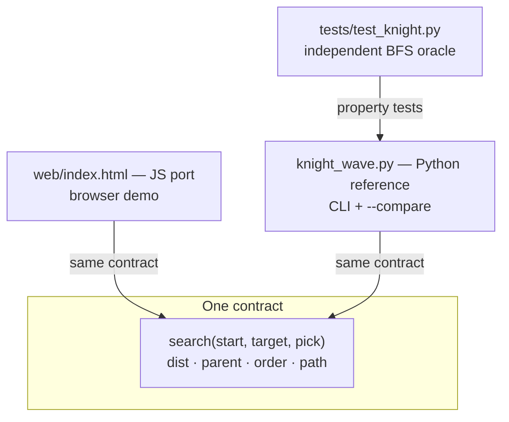

# Knight Search Lab

Five pathfinding algorithms — **BFS, DFS, A\*, Greedy, and Bidirectional BFS** — on an 8×8 knight's board, delivered as a browser demo, a terminal reference, and an oracle-backed test suite. Zero runtime dependencies in both ecosystems: open a file or run a script, nothing to install.

**What this demonstrates:** one search skeleton parameterized by frontier strategy, an admissible heuristic whose properties are *asserted* rather than claimed, and honest delivery decisions (single file, two ports, no framework) written down where a reviewer can challenge them.

## Quick start

| To… | Run | Result |
|-----|-----|--------|
| See it | open `web/index.html` | works from `file://`, no build, no network |
| Animate it | `python3 knight_wave.py a1 h8 --fast --algo="A*"` | terminal wave animation |
| Compare all five | `python3 knight_wave.py a1 h8 --compare` | moves / visited / bars |
| Test everything | `python3 tests/test_knight.py` | `9/9 passed` (~1s, stdlib only) |

## Results (a1 → h8)

| Algorithm | Moves | Squares visited | Optimal |
|-----------|------:|----------------:|:-------:|
| BFS | 6 | 62 | ✓ |
| DFS | 20 | 29 | ✗ |
| A\* | 6 | 40 | ✓ |
| Greedy | 6 | 6 | ✗ (guarantee, not luck) |
| Bidirectional BFS | 6 | 7 | ✓ |

Same destination, same guarantee on three of them — the cost difference is entirely in *how much of the board they touch*.

## Architecture



| Layer | Entry point | Role |
|-------|-------------|------|
| Demo | `web/index.html` | step waves, per-algorithm lesson text, COMPARE table with bars |
| Reference | `knight_wave.py` | terminal animation, `--compare`, `selfcheck` |
| Verification | `tests/test_knight.py` | 9 property tests against an oracle that re-implements distances itself |
| Metadata | `pyproject.toml` | project identity + pytest config; **no runtime dependencies** |

The four headless algorithms (BFS, DFS, A\*, Greedy) are frontier swaps over one `search()` skeleton: `pick()` decides which open square expands next. Bidirectional BFS is its own two-wave pass that stitches a path across the meeting link.

## Project structure

```
knight-search-lab/
├── web/
│   └── index.html          # browser demo — single file, inline SVG, no build
├── knight_wave.py          # terminal reference — animation + --compare
├── tests/
│   └── test_knight.py      # property tests vs an independent BFS oracle
├── pyproject.toml          # metadata + pytest config (no runtime deps)
├── README.md
└── odd/tasks/              # working tracker for this exercise
```

## Why this shape

| Decision | Reasoning |
|----------|-----------|
| Single-file HTML, no framework | A static board with a few thousand DOM ops does not justify React plus a build step. It runs from `file://` with zero installs. |
| Flat layout (module at root), not `src/` | `src/` implies an install step; keeping `knight_wave.py` at the root preserves the zero-install quick start. `pyproject.toml` declares the module for tooling without forcing it. |
| Two ports (JS + Python), not one | Intentional: the browser is the demo, Python is the reference you read and test. Same contract in both — see the header comments. |
| Heuristic `max(ceil(max(dr,dc)/2), ceil((dr+dc)/3))` | Admissible (never overestimates) and 1-Lipschitz — exactly what makes A\* optimal. Both properties are asserted in the tests. |
| Tests bring their own oracle | The suite re-implements distances with its own BFS and its own knight moves, so a shared bug cannot hide from itself. |

## Testing

```bash
python3 tests/test_knight.py   # zero dependencies, runs anywhere
python3 -m pytest              # if pytest is installed (see pyproject.toml)
```

The suite checks, on **all 4096 start/target pairs**: every algorithm returns a legal knight walk; BFS, A\*, and bidirectional BFS match the oracle's exact distance; the heuristic is admissible and 1-Lipschitz everywhere; orders are duplicate-free with roots excluded; degenerate pairs (start = target) behave. Verified by mutation: a heuristic that overestimates is caught.

## Checklist

- [ ] `web/index.html` opens from disk with no network requests
- [ ] `python3 tests/test_knight.py` → `9/9 passed`
- [ ] `python3 knight_wave.py --check` → `selfcheck ok`
- [ ] `python3 knight_wave.py a1 h8 --compare` → BFS/A\*/Greedy/Bi-BFS tie at 6 moves, DFS costs 20

## Extending

Natural next steps, in order of value: CI (test matrix on push), a Spanish lesson-text variant of the web demo, and an interactive "pick your own heuristic" mode.
